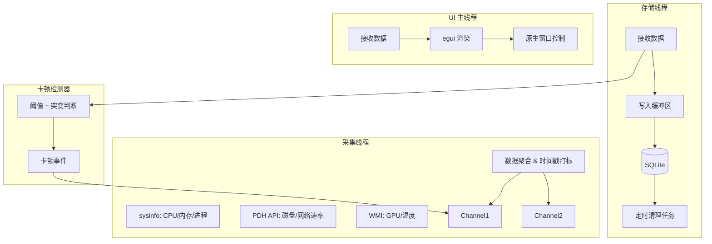

# 系统卡顿监控日志器 + 悬浮窗 — 最终实现方案

> **现状说明（2026-08）**：本文件为早期设计文档，主体已按 P3 服务化落地，部分内容
> 已与实现不同，阅读时以 README.md / TODO.md 为准：
> - **UI 框架**：已从 egui 迁移到 **Slint 1.x**（`crates/ui/ui/*.slint`，winit 后端，
>   原生拖拽无重影、透明置顶正常）。
> - **进程模型**：已改为「**Windows 服务采集写库 + GUI 只读轮询**」（P3 重构），
>   非本文件的单进程多线程 / Named Pipe 方案；并发经 SQLite WAL 模式解决。
> - **模块布局**：`collector / detector / logger / types` 在 `crates/core`；
>   服务在 `crates/service`；UI 与进程详情页在 `crates/ui`；入口在 `crates/bin`。
> 下文保留作为设计演进记录。

## 1. 核心架构设计
采用 **生产者-消费者** 模式，将系统采集、数据分析、数据存储与 UI 渲染完全解耦。
### 1.1 进程模型
- **GUI 模式**：单进程，内含 `Collector Thread`（采集线程）、`Logger Thread`（存储线程）、`UI Thread`（主线程）。
- **服务模式**：无 UI，`Collector` + `Logger` 常驻后台，通过 Named Pipe 提供 IPC 接口。
- **互斥机制**：GUI 启动时检测服务状态，若服务运行中则切换为“客户端模式”（仅显示，不采集）。
### 1.2 数据流图

---
## 2. 技术选型修正
| 组件 | 技术 | 修正理由 |
|------|------|---------|
| **磁盘/网速** | `windows` crate (PDH API) | 解决 `sysinfo` 无法获取精确实时速率的问题，性能优于 WMI |
| **GPU 利用率** | `wmi` + `Win32_PerfFormattedData_GPUPerformanceCounters` | 替代无效的 `Win32_VideoController` |
| **温度** | 可选特性，尝试读取 WMI `MSStorageDriver` | 降级方案：失败则显示 N/A |
| **并发通道** | `crossbeam-channel` | 高性能，支持 `select!` 宏，适合多消费者场景 |
| **原生窗口** | `raw-window-handle` + `winapi` | 必须手动控制 `WS_EX_LAYERED` 等属性以实现透明与穿透 |
| **配置** | `notify` crate | 监听文件变更实现热加载 |
---
## 3. 模块详细设计
### 3.1 采集器 (`collector.rs`)
核心难点在于多数据源的并发与时钟同步。
**策略**：使用一个主循环（1s 间隔），拆分为快慢通道。
- **快通道 (1s)**：CPU, 内存, 磁盘, 网络（PDH 查询耗时极低）。
- **慢通道 (5s)**：GPU, 温度, 进程列表（WMI 查询较重，且变化慢）。
**代码结构示意**：
```rust
pub fn run_collector(tx: Sender<Sample>) {
    let mut pdh_disk = PdhCounter::new(r"\PhysicalDisk(_Total)\Disk Read Bytes/sec");
    // ... 其他计数器初始化
    
    let mut tick = 0;
    loop {
        let now = SystemTime::now();
        let mut sample = Sample::default();
        
        // 1. 快通道采集
        sample.cpu = get_cpu_usage(); // sysinfo
        sample.disk_read = pdh_disk.query_value(); // PDH
        
        // 2. 慢通道采集 (每5秒一次)
        if tick % 5 == 0 {
            sample.gpu = query_gpu_usage(); // WMI
            sample.temp = query_temperature(); // WMI
        }
        
        // 3. 发送数据
        tx.send(sample);
        
        // 4. 精确睡眠控制
        tick += 1;
        std::thread::sleep(Duration::from_secs(1));
    }
}
```
### 3.2 原生窗口控制器 (`ui/native.rs`)
此模块负责处理 egui 无法直接处理的 Win32 特性。
**功能清单**：
1. **透明与置顶**：设置 `WS_EX_LAYERED | WS_EX_TOPMOST`。
2. **点击穿透**：
   - 提供 `set穿透(bool)` 接口。
   - 若开启穿透，设置 `WS_EX_TRANSPARENT`。
   - **注意**：开启后拖拽功能失效，需通过右键菜单“切换穿透模式”控制。
3. **无边框拖拽**：
   - 默认状态下，拦截 `WM_NCHITTEST` 返回 `HTCAPTION` 实现拖拽。
**实现关键**：
```rust
// 在 eframe 初始化后，获取原生句柄
fn customize_window(window: &Window) {
    let hwnd = window.hwnd();
    unsafe {
        // 设置分层窗口和置顶
        let ex_style = GetWindowLongPtrW(hwnd, GWL_EXSTYLE);
        SetWindowLongPtrW(hwnd, GWL_EXSTYLE, ex_style | WS_EX_LAYERED | WS_EX_TOPMOST);
        
        // 设置透明度 (Alpha 0-255)
        SetLayeredWindowAttributes(hwnd, 0, 255, LWA_ALPHA);
    }
}
```
### 3.3 卡顿检测器 (`detector.rs`)
实现 **“硬阈值 + 突变检测 + UI 响应”** 三维判定。
**判定逻辑**：
```rust
fn analyze(&mut self, current: &Sample) -> Option<StutterEvent> {
    let mut flags = vec![];
    
    // 1. 硬阈值
    if current.cpu > 90.0 { flags.push("CPU High"); }
    if current.mem_available < 500 { flags.push("Mem Low"); }
    
    // 2. 突变检测 (滑动窗口)
    if let Some(prev) = self.history.last() {
        if current.disk_read > prev.disk_read * 5.0 && prev.disk_read > 1024 {
            flags.push("Disk Spike");
        }
    }
    
    // 3. UI 响应检测 (可选高级特性)
    // 尝试向前台窗口发送消息，超时则判定卡顿
    #[cfg(feature = "advanced_detection")]
    if is_foreground_window_frozen() {
        flags.push("UI Frozen");
    }
    
    if !flags.is_empty() {
        return Some(StutterEvent { causes: flags, .. });
    }
    None
}
```
### 3.4 存储与导出 (`logger.rs`)
**写入策略**：
- 使用**批量写入**：内部维护一个 `Vec<Sample>` 缓冲区，每 10 条数据或每 5 秒触发一次事务写入，减少 SQLite 锁竞争。
- **清理逻辑**：维护一个 `AtomicU64` 计数器，每 3600 次采样执行 `DELETE FROM samples WHERE timestamp < now() - 30 days`。
**CSV 导出**：
- 使用 `rusqlite` 的 `query_map` 迭代器配合 `csv::Writer`，流式写入文件，内存占用恒定。
### 3.5 任务栏嵌入 (`ui/taskbar.rs`)
**Feature 开关**：`#[cfg(feature = "taskbar")]`
**实现策略**：
- **Phase 1 (推荐)**：不进行原生注入。实现一个尺寸极小、无边框、背景透明的“伪任务栏窗口”，默认位置设置在屏幕底部。用户可手动将其拖动到任务栏空白处。
- **Phase 2 (高难度)**：如果必须嵌入，尝试创建一个 `Toolbar` 窗口作为 DeskBand 实现。需大量处理 Win7/10/11 的兼容性宏。
---
## 4. 数据结构定义
```rust
#[derive(Debug, Clone, Serialize, Deserialize)]
pub struct Sample {
    pub timestamp: SystemTime,
    
    // 基础指标
    pub cpu_usage: f32,
    pub mem_usage: f32,
    pub mem_available_mb: u64,
    
    // IO 指标 (PDH 来源)
    pub disk_read_bps: u64,
    pub disk_write_bps: u64,
    pub net_sent_bps: u64,
    pub net_recv_bps: u64,
    
    // 慢指标 (WMI 来源)
    pub gpu_usage: Option<f32>, // None 表示不可用
    pub cpu_temp: Option<f32>,
    
    // 进程统计
    pub process_count: u64,
}
#[derive(Debug, Clone)]
pub struct StutterEvent {
    pub timestamp: SystemTime,
    pub severity: Severity, // Minor, Major, Critical
    pub causes: Vec<&'static str>,
    pub snapshot: Sample,
}
```
---
## 5. 配置与皮肤系统完善
**config.toml 更新**：
```toml
[sampling]
interval_ms = 1000
slow_interval_factor = 5  # 慢指标采集周期倍数
[detection]
# 引入基线阈值，避免低负载时的误报
cpu_spike_min_baseline_percent = 20.0 
disk_spike_min_baseline_bps = 10240
[ui]
# 穿透模式：默认关闭，避免无法拖动
mouse_transparent = false 
click_through = false
[advanced]
# 尝试检测前台窗口冻结 (SendMessageTimeout)
detect_ui_freeze = true
```
**皮肤系统**：
- 增加 `clickable_alpha_threshold` 字段：控制像素透明度低于多少值时视为不可点击（用于实现异形窗口点击）。
---
## 6. 实施路线图
### 阶段一：核心骨架 (MVP)
1. **Day 1-2**: 搭建项目结构，实现 `Collector` 线程与 `Channel` 通信。
2. **Day 3-4**: 完成 `PDH` 磁盘/网络采集集成；实现基础 SQLite 存储。
3. **Day 5-6**: 实现基础 `eframe` 窗口，验证透明背景与系统托盘。
### 阶段二：原生窗口与交互
1. **Day 7-9**: 编写 `native.rs`，实现 Win32 API 调用（置顶、透明、无边框拖拽）。
2. **Day 10-11**: 实现右键菜单、配置热加载 (`notify`)。
### 阶段三：高级功能与优化
1. **Day 12-14**: 接入 GPU (WMI) 与 温度采集，实现降级逻辑。
2. **Day 15-17**: 完善卡顿检测引擎，实现 `StutterEvent` 记录与弹窗提醒。
3. **Day 18**: 实现 CSV 流式导出。
### 阶段四：服务与打包
1. **Day 19-21**: Windows 服务模式实现 (`windows-service`)；服务与 GUI 的互斥逻辑。
2. **Day 22-23**: Installer 制作，开机自启注册。

---

## 8. P3 实际实现备注（2026-07）

原 PLAN §1.1 设想的服务模式用 **Named Pipe + GUI 客户端模式**（服务主动 push 事件）。
实际 P3 改造采用了**更轻量的 SQLite WAL 轮询**：

| 原方案 | 实际方案 | 优点 |
| --- | --- | --- |
| Named Pipe 推流 | SQLite WAL 读视图 | 无需定义 IPC 协议；服务崩溃 GUI 自动"断流" |
| 互斥检测（服务在跑则 GUI 切客户端） | 始终只读（无自采） | 行为确定；单进程不再双模式 |
| IPC 心跳 | `service_heartbeat` 单行 UPSERT | GUI 1Hz 轮询心跳表 → Running/Stale/Stopped/NoDatabase |

代码侧：
- `crates/service/`（独立 crate） — Windows service + 6 个 CLI 子命令
- `crates/core/src/logger.rs` — 加 `service_heartbeat` 表 + `touch_heartbeat()` / `latest_heartbeat()` / `latest_sample_summary()`
- `crates/ui/src/reader.rs` — `DbReader` 1Hz 轮询
- `crates/ui/ui/overlay.slint` — 顶部加服务健康状态条

测试：111 个全过（core 65 + service 16 + ui 30）。

---
## 7. 关键代码片段参考
### 磁盘速率采集 (PDH API)
```rust
use windows::Win32::System::Performance::*;
struct PdhCounter {
    query: PDH_HQUERY,
    counter: PDH_HCOUNTER,
}
impl PdhCounter {
    fn new(path: &str) -> Self {
        let mut query = null_mut();
        let mut counter = null_mut();
        unsafe {
            PdhOpenQueryW(None, 0, &mut query);
            PdhAddCounterW(query, path, 0, &mut counter);
        }
        Self { query, counter }
    }
    
    fn query_value(&self) -> f64 {
        let mut value = std::mem::zeroed();
        unsafe {
            PdhCollectQueryData(self.query);
            // 注意：第一次调用可能会失败，需要处理 PDH_NO_DATA
            PdhGetFormattedCounterValue(self.counter, PDH_FMT_DOUBLE, None, &mut value);
        }
        value.Anonymous.doubleValue
    }
}
```
### UI 冻结检测
```rust
use windows::Win32::UI::WindowsAndMessaging::*;
use windows::Win32::Foundation::*;
fn is_foreground_window_frozen() -> bool {
    unsafe {
        let hwnd = GetForegroundWindow();
        if hwnd.is_null() { return false; }
        
        let result = SendMessageTimeoutW(
            hwnd, 
            WM_NULL, 
            0, 
            0, 
            SMTO_ABORTIFHUNG | SMTO_BLOCK, 
            500, // 500ms 超时
            None
        );
        result.0 == 0 // 0 表示超时或失败
    }
}
```
